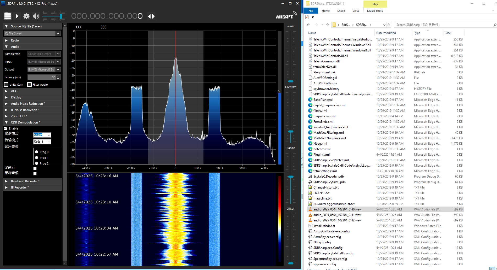

# [CDR Plugin for SDR#]

## 项目简介
实现一个简单的CDR解调插件。

## 功能特点
实现CDR信号的解调并录制解调后的音频。

提供原始IQ数据录制，用于调试。


## 安装方法
将 libfftw3f-3.dll libcdrRelease.dll 和 SDRSharp.CDR.dll 复制到 SDR# 目录中。修改 Plugins.xml 插件配置，添加 

 ```<add key="CDR" value="SDRSharp.CDR.CDRPlugin,SDRSharp.CDR" /> ``` 




## 使用方式
插件处理的信号是RAW IQ, 即整个频谱信号，因此需要将SDR的采集带宽设置在500k~800kHz 之间。

此外CDR解调对频偏要求比较高，因此需要将频率对准实际发射频率，即频谱中心模拟FM的中心频率，一般都是100kHz的整数倍。

## 已知问题
CDR解调的第一步是同步信号，该步骤计算量较大。如果信号质量不佳或者设置参数不正确，会不停的尝试同步，由此造成卡顿。多次卡顿后，RAW IQ数据会溢出导致软件Crash。

该问题有待后续版本优化。


## Todo
通过SDR#播放解调后的音频。

增加CDR的参数显示。